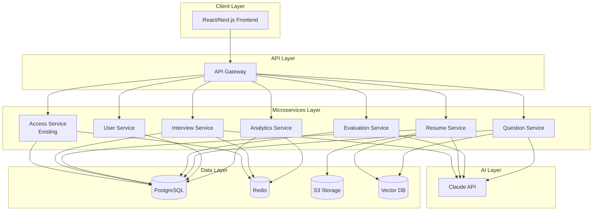

# Design Document: Interview Platform Microservices

## Overview

This design document outlines the implementation of 6 microservices for an AI-powered interview platform built on Java Spring Boot. The system extends an existing repository with an access-service to provide comprehensive interview management capabilities. The architecture follows microservice patterns with clear separation of concerns, standardized communication protocols, and integration with AI services.

The platform consists of:
- **Interview Service**: Session management and real-time interactions
- **Resume Service**: Document processing and candidate data management  
- **Evaluation Service**: Assessment processing and scoring algorithms
- **Question Service**: Question bank management and categorization
- **User Service**: Profile management and user preferences
- **Analytics Service**: Data aggregation and reporting capabilities

Each service is designed as an independent Spring Boot application following the existing Maven multi-module structure, with standardized REST APIs, consistent data access patterns, and integration with the existing access-service for authentication.

## Architecture

### System Architecture



### Service Communication Patterns

**Synchronous Communication:**
- REST APIs for direct service-to-service calls
- JWT token validation through access-service
- Circuit breaker pattern for resilience

**Asynchronous Communication:**
- Event-driven architecture for loose coupling
- Message queues for background processing
- Event sourcing for audit trails

**Data Consistency:**
- Database per service pattern
- Saga pattern for distributed transactions
- Eventually consistent data synchronization

## Components and Interfaces

### Interview Service

**Core Components:**
- `SessionController`: REST endpoints for session management
- `SessionService`: Business logic for interview sessions
- `SessionRepository`: Data access for session entities
- `RealTimeHandler`: WebSocket handler for live interactions
- `SchedulingService`: Interview scheduling and notifications

**Key Entities:**
```java
@Entity
public class InterviewSession {
    private UUID sessionId;
    private UUID interviewerId;
    private UUID candidateId;
    private SessionStatus status;
    private LocalDateTime scheduledTime;
    private LocalDateTime startTime;
    private LocalDateTime endTime;
    private String sessionType;
    private Map<String, Object> metadata;
    private List<SessionInteraction> interactions;
}

@Entity
public class SessionInteraction {
    private UUID interactionId;
    private UUID sessionId;
    private InteractionType type;
    private String content;
    private LocalDateTime timestamp;
    private UUID participantId;
}
```

**REST API Endpoints:**
- `POST /api/v1/interviews/sessions` - Create new session
- `GET /api/v1/interviews/sessions/{id}` - Get session details
- `PUT /api/v1/interviews/sessions/{id}` - Update session
- `POST /api/v1/interviews/sessions/{id}/join` - Join session
- `POST /api/v1/interviews/sessions/{id}/interactions` - Add interaction
- `GET /api/v1/interviews/sessions/{id}/status` - Get session status

### Resume Service

**Core Components:**
- `ResumeController`: REST endpoints for resume operations
- `ResumeService`: Business logic for resume processing
- `ResumeRepository`: Data access for resume entities
- `ParsingService`: Document parsing and data extraction
- `AnalysisService`: AI-powered resume analysis
- `StorageService`: File storage management

**Key Entities:**
```java
@Entity
public class Resume {
    private UUID resumeId;
    private UUID candidateId;
    private String originalFileName;
    private String s3Key;
    private ResumeStatus status;
    private LocalDateTime uploadedAt;
    private LocalDateTime parsedAt;
    private ResumeData parsedData;
    private List<ResumeAnalysis> analyses;
}

@Embeddable
public class ResumeData {
    private PersonalInfo personalInfo;
    private List<WorkExperience> workExperience;
    private List<Education> education;
    private List<String> skills;
    private List<String> certifications;
}
```

**REST API Endpoints:**
- `POST /api/v1/resumes/upload` - Upload resume file
- `GET /api/v1/resumes/{id}` - Get resume details
- `POST /api/v1/resumes/{id}/analyze` - Trigger AI analysis
- `GET /api/v1/resumes/{id}/analysis` - Get analysis results
- `GET /api/v1/resumes/search` - Search resumes by criteria

### Evaluation Service

**Core Components:**
- `EvaluationController`: REST endpoints for evaluation operations
- `EvaluationService`: Business logic for assessment processing
- `EvaluationRepository`: Data access for evaluation entities
- `ScoringEngine`: Automated scoring algorithms
- `AIEvaluationService`: AI-powered evaluation analysis
- `ReportGenerator`: Evaluation report generation

**Key Entities:**
```java
@Entity
public class Evaluation {
    private UUID evaluationId;
    private UUID sessionId;
    private UUID candidateId;
    private UUID evaluatorId;
    private EvaluationStatus status;
    private LocalDateTime createdAt;
    private LocalDateTime completedAt;
    private List<EvaluationCriteria> criteria;
    private EvaluationResult result;
}

@Entity
public class EvaluationCriteria {
    private UUID criteriaId;
    private String name;
    private String description;
    private Integer weight;
    private Double score;
    private String feedback;
    private CriteriaType type;
}
```

**REST API Endpoints:**
- `POST /api/v1/evaluations` - Create evaluation
- `GET /api/v1/evaluations/{id}` - Get evaluation details
- `PUT /api/v1/evaluations/{id}/score` - Update scores
- `POST /api/v1/evaluations/{id}/complete` - Complete evaluation
- `GET /api/v1/evaluations/{id}/report` - Generate evaluation report

### Question Service

**Core Components:**
- `QuestionController`: REST endpoints for question management
- `QuestionService`: Business logic for question operations
- `QuestionRepository`: Data access for question entities
- `CategoryService`: Question categorization management
- `TemplateService`: Question template processing
- `AIQuestionService`: AI-powered question generation

**Key Entities:**
```java
@Entity
public class Question {
    private UUID questionId;
    private String title;
    private String content;
    private QuestionType type;
    private DifficultyLevel difficulty;
    private UUID categoryId;
    private List<String> tags;
    private String expectedAnswer;
    private Integer timeLimit;
    private QuestionStatus status;
    private LocalDateTime createdAt;
    private UUID createdBy;
}

@Entity
public class QuestionCategory {
    private UUID categoryId;
    private String name;
    private String description;
    private UUID parentCategoryId;
    private List<QuestionCategory> subCategories;
    private Integer questionCount;
}
```

**REST API Endpoints:**
- `POST /api/v1/questions` - Create question
- `GET /api/v1/questions/{id}` - Get question details
- `GET /api/v1/questions/search` - Search questions
- `POST /api/v1/questions/categories` - Create category
- `GET /api/v1/questions/categories` - List categories
- `POST /api/v1/questions/generate` - AI question generation

### User Service

**Core Components:**
- `UserController`: REST endpoints for user management
- `UserService`: Business logic for user operations
- `UserRepository`: Data access for user entities
- `ProfileService`: User profile management
- `PreferenceService`: User preference handling
- `ActivityService`: User activity tracking

**Key Entities:**
```java
@Entity
public class UserProfile {
    private UUID userId;
    private String firstName;
    private String lastName;
    private String email;
    private String phoneNumber;
    private UserRole role;
    private UserStatus status;
    private LocalDateTime createdAt;
    private LocalDateTime lastLoginAt;
    private UserPreferences preferences;
    private List<UserActivity> activities;
}

@Embeddable
public class UserPreferences {
    private String timezone;
    private String language;
    private Map<String, Object> notificationSettings;
    private Map<String, Object> uiPreferences;
}
```

**REST API Endpoints:**
- `GET /api/v1/users/profile` - Get user profile
- `PUT /api/v1/users/profile` - Update user profile
- `GET /api/v1/users/{id}` - Get user by ID
- `PUT /api/v1/users/{id}/preferences` - Update preferences
- `GET /api/v1/users/{id}/activity` - Get user activity

### Analytics Service

**Core Components:**
- `AnalyticsController`: REST endpoints for analytics operations
- `AnalyticsService`: Business logic for data analysis
- `DataAggregationService`: Data collection and aggregation
- `ReportService`: Report generation and formatting
- `MetricsService`: Real-time metrics calculation
- `ExportService`: Data export capabilities

**Key Entities:**
```java
@Entity
public class AnalyticsReport {
    private UUID reportId;
    private String reportType;
    private String title;
    private LocalDateTime generatedAt;
    private UUID generatedBy;
    private Map<String, Object> parameters;
    private ReportData data;
    private ReportStatus status;
}

@Entity
public class PlatformMetrics {
    private UUID metricId;
    private String metricName;
    private String metricType;
    private Double value;
    private LocalDateTime timestamp;
    private Map<String, String> dimensions;
}
```

**REST API Endpoints:**
- `GET /api/v1/analytics/dashboard` - Get dashboard metrics
- `POST /api/v1/analytics/reports` - Generate custom report
- `GET /api/v1/analytics/reports/{id}` - Get report details
- `GET /api/v1/analytics/metrics` - Get real-time metrics
- `POST /api/v1/analytics/export` - Export analytics data

## Data Models

### Database Schema Design

**Service-Specific Databases:**
Each microservice maintains its own database schema within PostgreSQL, following the database-per-service pattern while allowing for shared infrastructure.

**Common Patterns:**
- UUID primary keys for all entities
- Audit fields (createdAt, updatedAt, createdBy, updatedBy)
- Soft delete support with deletedAt timestamps
- Version fields for optimistic locking
- JSON columns for flexible metadata storage

**Relationships:**
- Cross-service references use UUIDs only
- No foreign key constraints across service boundaries
- Event-driven synchronization for data consistency
- Eventual consistency patterns for cross-service data

### Caching Strategy

**Redis Usage:**
- Session data caching (30-minute TTL)
- User authentication tokens (JWT expiration-based TTL)
- Frequently accessed question sets (1-hour TTL)
- Real-time metrics (5-minute TTL)
- API response caching for expensive operations (15-minute TTL)

**Cache Patterns:**
- Write-through for critical data
- Write-behind for analytics data
- Cache-aside for read-heavy operations
- Distributed caching with Redis Cluster

### File Storage Architecture

**S3 Storage Organization:**
```
interview-platform/
├── resumes/
│   ├── original/{userId}/{resumeId}.{ext}
│   └── processed/{userId}/{resumeId}.json
├── session-recordings/
│   └── {sessionId}/{timestamp}.{format}
├── evaluation-reports/
│   └── {evaluationId}/{reportId}.pdf
└── exports/
    └── {reportId}/{filename}.{format}
```

**File Processing Pipeline:**
- Asynchronous processing for uploaded files
- Virus scanning and validation
- Format conversion and optimization
- Metadata extraction and indexing

## Correctness Properties

*A property is a characteristic or behavior that should hold true across all valid executions of a system-essentially, a formal statement about what the system should do. Properties serve as the bridge between human-readable specifications and machine-verifiable correctness guarantees.*

### Interview Service Properties

**Property 1: Session Creation Uniqueness**
*For any* interview session creation request, the Interview_Service should generate a unique session identifier and initialize the session with proper default state
**Validates: Requirements 1.1**

**Property 2: Session State Consistency**
*For any* session state transition (join, interaction, end), the Interview_Service should maintain consistent state and trigger appropriate downstream processes
**Validates: Requirements 1.3, 1.4, 1.5**

**Property 3: Session Data Completeness**
*For any* session data retrieval request, the Interview_Service should return complete session information including all participants and interactions
**Validates: Requirements 1.6**

### Resume Service Properties

**Property 4: Resume Processing Round Trip**
*For any* valid resume file upload, parsing then storing should preserve all extractable information and maintain file integrity
**Validates: Requirements 2.1, 2.2**

**Property 5: Resume Format Support**
*For any* supported file format (PDF, DOC, DOCX), the Resume_Service should successfully parse and extract structured data
**Validates: Requirements 2.6**

**Property 6: Resume Versioning Consistency**
*For any* resume data update, the Resume_Service should maintain complete version history and audit trail without data loss
**Validates: Requirements 2.5**

**Property 7: Resume Search Accuracy**
*For any* search criteria, the Resume_Service should return only candidates that match all specified criteria
**Validates: Requirements 2.4**

### Evaluation Service Properties

**Property 8: Evaluation Workflow Completeness**
*For any* completed interview session, the Evaluation_Service should initiate evaluation, calculate scores, and generate reports
**Validates: Requirements 3.1, 3.2, 3.4**

**Property 9: Evaluation Criteria Application**
*For any* evaluation criteria update, the Evaluation_Service should apply new criteria only to future evaluations while preserving historical evaluations
**Validates: Requirements 3.6**

**Property 10: Evaluation Data Integrity**
*For any* evaluation query, the Evaluation_Service should return comprehensive and consistent evaluation results
**Validates: Requirements 3.5**

### Question Service Properties

**Property 11: Question Management Completeness**
*For any* question creation or update, the Question_Service should store complete metadata, maintain version history, and preserve hierarchical category relationships
**Validates: Requirements 4.1, 4.3, 4.5**

**Property 12: Question Retrieval Accuracy**
*For any* question set request with specified criteria, the Question_Service should return only questions that match all criteria
**Validates: Requirements 4.2**

**Property 13: Question Analytics Consistency**
*For any* question analytics request, the Question_Service should provide accurate usage statistics and effectiveness metrics based on historical data
**Validates: Requirements 4.4**

### User Service Properties

**Property 14: User Profile Separation**
*For any* user profile operation, the User_Service should maintain profile data completely separate from authentication data while coordinating with Access_Service for authorization
**Validates: Requirements 5.1, 5.3**

**Property 15: User Data Completeness**
*For any* user data request, the User_Service should return complete profile information including preferences and activity history
**Validates: Requirements 5.5**

**Property 16: User Preference Persistence**
*For any* user preference update, the User_Service should persist changes and ensure they are applied to subsequent user experiences
**Validates: Requirements 5.2**

### Analytics Service Properties

**Property 17: Analytics Data Aggregation**
*For any* analytics request, the Analytics_Service should aggregate data from all relevant microservices and provide comprehensive insights
**Validates: Requirements 6.1, 6.2**

**Property 18: Real-time Metrics Accuracy**
*For any* real-time metrics request, the Analytics_Service should provide current platform statistics that accurately reflect the system state
**Validates: Requirements 6.3**

**Property 19: Historical Analysis Consistency**
*For any* historical analysis request, the Analytics_Service should process time-series data and provide consistent trend analysis
**Validates: Requirements 6.4**

### Platform Integration Properties

**Property 20: Service Communication Standardization**
*For any* inter-service communication, the Platform should use standardized REST APIs with consistent data formats and authentication integration
**Validates: Requirements 7.1, 7.2**

**Property 21: Platform Resilience**
*For any* service failure scenario, the Platform should implement circuit breaker patterns and maintain graceful degradation
**Validates: Requirements 7.5**

**Property 22: Data Storage Compliance**
*For any* data persistence operation, the Platform should use the appropriate storage system (PostgreSQL for relational data, Redis for caching, S3 for files, Vector_DB for vector data)
**Validates: Requirements 8.1, 8.2, 8.3, 8.4**

**Property 23: AI Integration Standardization**
*For any* AI-powered operation, the Platform should integrate with Claude API through standardized interfaces and implement proper error handling and rate limiting
**Validates: Requirements 9.1, 9.5, 9.6**

**Property 24: Deployment Consistency**
*For any* service deployment, the Platform should follow Maven multi-module structure, Spring Boot configuration patterns, and maintain consistent dependency versions
**Validates: Requirements 10.1, 10.2, 10.6**

## Error Handling

### Exception Hierarchy

**Custom Exception Structure:**
```java
public abstract class InterviewPlatformException extends RuntimeException {
    private final String errorCode;
    private final Map<String, Object> context;
}

public class ServiceUnavailableException extends InterviewPlatformException {
    // For circuit breaker scenarios
}

public class ValidationException extends InterviewPlatformException {
    // For input validation failures
}

public class AuthorizationException extends InterviewPlatformException {
    // For access control violations
}

public class ResourceNotFoundException extends InterviewPlatformException {
    // For missing resources
}

public class ExternalServiceException extends InterviewPlatformException {
    // For AI API and external service failures
}
```

### Error Response Format

**Standardized Error Response:**
```json
{
  "timestamp": "2024-01-15T10:30:00Z",
  "status": 400,
  "error": "Bad Request",
  "errorCode": "VALIDATION_FAILED",
  "message": "Invalid input parameters",
  "path": "/api/v1/interviews/sessions",
  "requestId": "uuid-here",
  "details": {
    "field": "scheduledTime",
    "rejectedValue": "invalid-date",
    "message": "Must be a valid future date"
  }
}
```

### Circuit Breaker Configuration

**Resilience Patterns:**
- Circuit breaker for AI API calls (failure threshold: 5, timeout: 30s)
- Retry mechanism for database operations (max attempts: 3, backoff: exponential)
- Timeout configuration for external service calls (30s default)
- Bulkhead pattern for resource isolation
- Rate limiting for API endpoints (100 requests/minute per user)

### Graceful Degradation

**Fallback Strategies:**
- AI analysis failures: Return basic analysis without AI insights
- External service unavailability: Use cached data when available
- Database connection issues: Return appropriate service unavailable responses
- File storage failures: Queue operations for retry with user notification

## Testing Strategy

### Dual Testing Approach

The testing strategy employs both unit testing and property-based testing to ensure comprehensive coverage:

**Unit Tests:**
- Focus on specific examples, edge cases, and error conditions
- Test integration points between components
- Validate specific business logic scenarios
- Test exception handling and error conditions

**Property-Based Tests:**
- Verify universal properties across all inputs through randomization
- Test system behavior with generated data sets
- Validate correctness properties defined in this design document
- Ensure comprehensive input coverage through automated generation

### Property-Based Testing Configuration

**Framework Selection:**
- **JUnit 5** with **jqwik** for property-based testing in Java
- Minimum 100 iterations per property test due to randomization
- Custom generators for domain-specific data types
- Shrinking support for minimal failing examples

**Test Organization:**
```java
@PropertyTest
@Tag("Feature: interview-platform-microservices, Property 1: Session Creation Uniqueness")
void sessionCreationGeneratesUniqueIdentifiers(@ForAll SessionCreationRequest request) {
    // Property test implementation
}
```

**Property Test Requirements:**
- Each correctness property must be implemented by a single property-based test
- Tests must reference their corresponding design document property
- Tag format: **Feature: interview-platform-microservices, Property {number}: {property_text}**
- Minimum 100 iterations per test to ensure statistical confidence

### Test Data Generation

**Custom Generators:**
- Session data with realistic scheduling constraints
- Resume files with various formats and content structures
- Evaluation criteria with different scoring rubrics
- Question sets with hierarchical categories
- User profiles with diverse preference combinations
- Analytics queries with time-based parameters

**Test Environment:**
- Testcontainers for database integration tests
- WireMock for external service mocking
- Redis embedded server for caching tests
- LocalStack for S3 integration tests
- Test-specific configuration profiles

### Integration Testing

**Service Integration Tests:**
- Cross-service communication validation
- Authentication flow testing with access-service
- Event-driven workflow testing
- Database transaction consistency testing
- Cache coherence validation

**End-to-End Testing:**
- Complete interview workflow testing
- Resume processing pipeline validation
- Evaluation generation and reporting
- Analytics data flow verification
- User experience journey testing

### Performance Testing

**Load Testing Scenarios:**
- Concurrent interview session management
- Bulk resume processing capabilities
- Real-time analytics query performance
- Database connection pool optimization
- Cache hit ratio optimization

**Performance Benchmarks:**
- API response times < 200ms for 95th percentile
- File upload processing < 30 seconds for typical resumes
- Analytics report generation < 5 seconds
- Session join latency < 1 second
- Database query performance < 100ms average